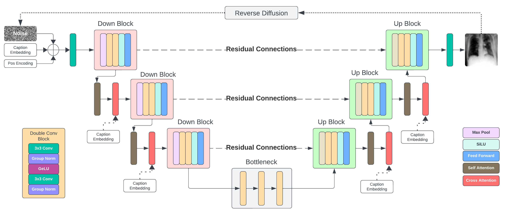
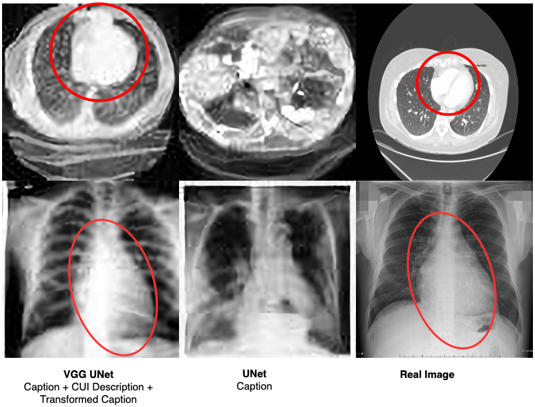

# LLM-Based Image Caption Augmentation for Text-Guided Radiology Image Generation Using Diffusion Models with Pretrained Encoders

The landscape of medical data analysis is evolving with advancements in natural language processing (NLP) and generative models. This research aims to enhance the interpretability of radiology images by integrating textual descriptions and medical concepts. We propose a baseline approach for text-to-image generation in radiology, focusing on two key contributions. First, we leverage large language models (LLMs) to transform image captions, enhancing their descriptive power and aligning them more closely with radiology images. Second, we experiment with both a standard UNet model and a custom VGG16-based UNet model to improve feature extraction and image generation quality. Our approach begins with extensive dataset pre-processing, narrowing down to the most relevant CUIs and filtering low-quality images using entropy measures. We then employ RadBERT as a text encoder to process textual inputs, aiming to capture diverse modalities and enrich feature representations. The diffusion model, central to our methodology, uses a linear noise schedule and classifier-free guidance to generate high-quality, text-aligned images. Experimental results demonstrate the effectiveness of our methods, with the transformed captions and VGG16-based UNet model achieving the best performance in terms of Fréchet Inception Distance (FID). Despite limitations due to hardware constraints, our approach sets a robust baseline for future research in this domain. The findings suggest that integrating advanced NLP techniques with generative models holds significant promise for improving the analysis and interpretation of radiology images, paving the way for more accurate and informed healthcare decisions.

## Approach

<br>

## Example Generation

<br>


## Usage

#### Options

- `data_path`: The path to the dataset.
- `model`: The model to train. Default is "UNet".
- `epochs`: The number of training epochs. Default is 100.
- `batch_size`: The batch size for training. Default is 12.
- `image_size`: The size of the input images. Default is 64.
- `k`: The number of top-k CUIs to use for training. Default is 10.
- `caption_mode`: The caption mode for the input images. Default is 2.
- `use_clip`: Whether to use CLIP for caption processing. Default is False.
- `device`: The device to run the training. Default is "cuda".
- `name`: The name of the experiment or run.

#### Example

To train a UNet model for 100 epochs with a batch size of 12 and an image size of 64, you would run:
```
python src/train_diffusion.py -model UNet -device cuda
```

